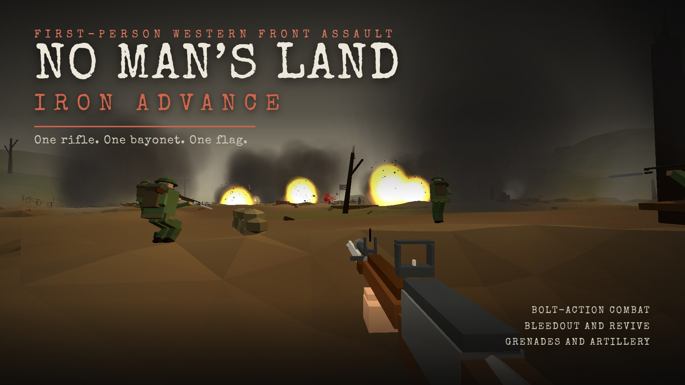
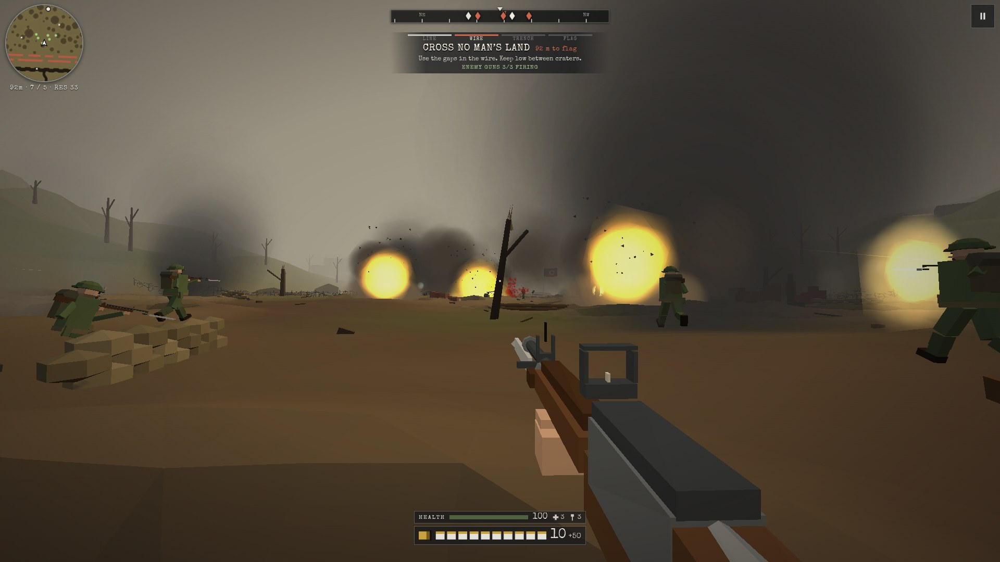
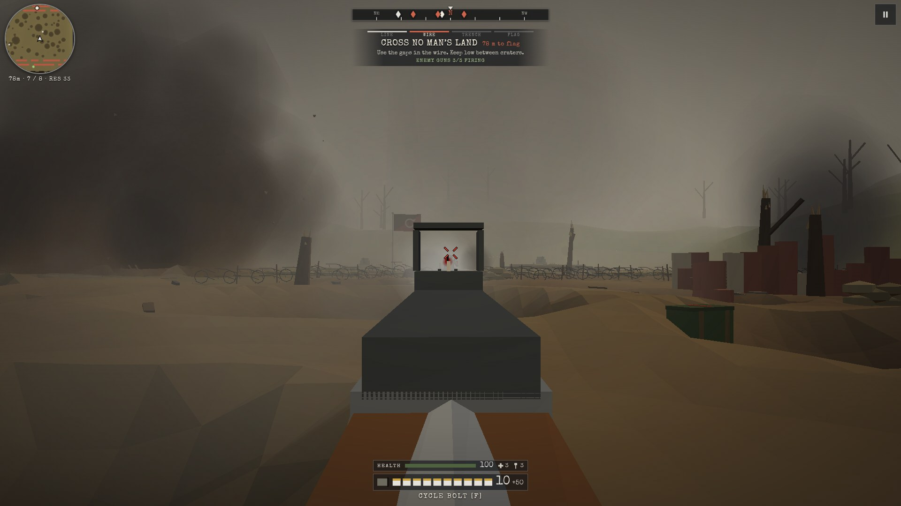
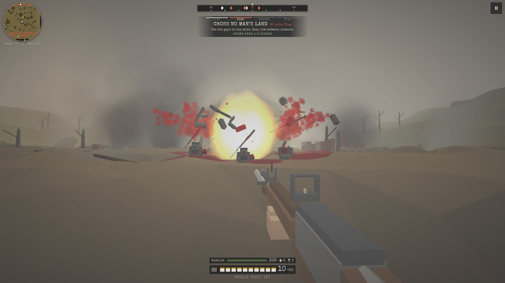
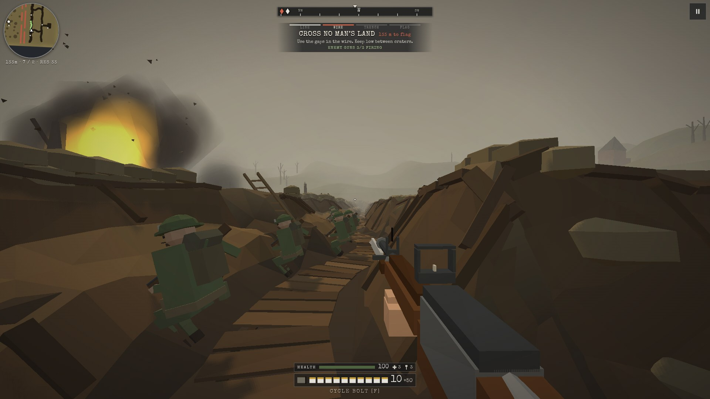
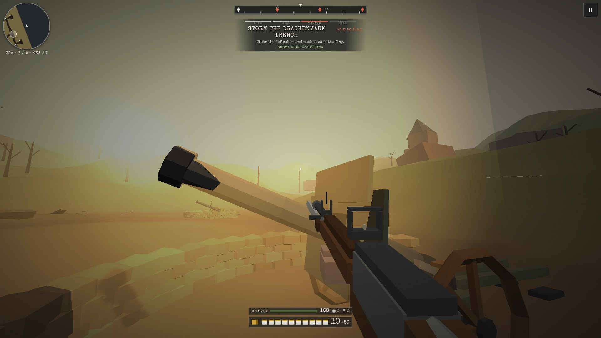

# No Man's Land: Iron Advance

A first-person World War I trench assault. Advance from your trench, cross no man's land, capture the enemy trench and seize the flag, armed with one bolt-action rifle, a fixed bayonet and a few stick grenades.

**Play it:** [ceanncaceire.github.io/no-mans-land-iron-advance-play](https://ceanncaceire.github.io/no-mans-land-iron-advance-play/)

Playable web build (v2.5). Open the Pages site and tap Play. Best on a phone in landscape or a desktop browser with keyboard and mouse.

## Screenshots

### Over the top

### Iron sights

### Grenade blast

### Trench defence

### Enemy battery

